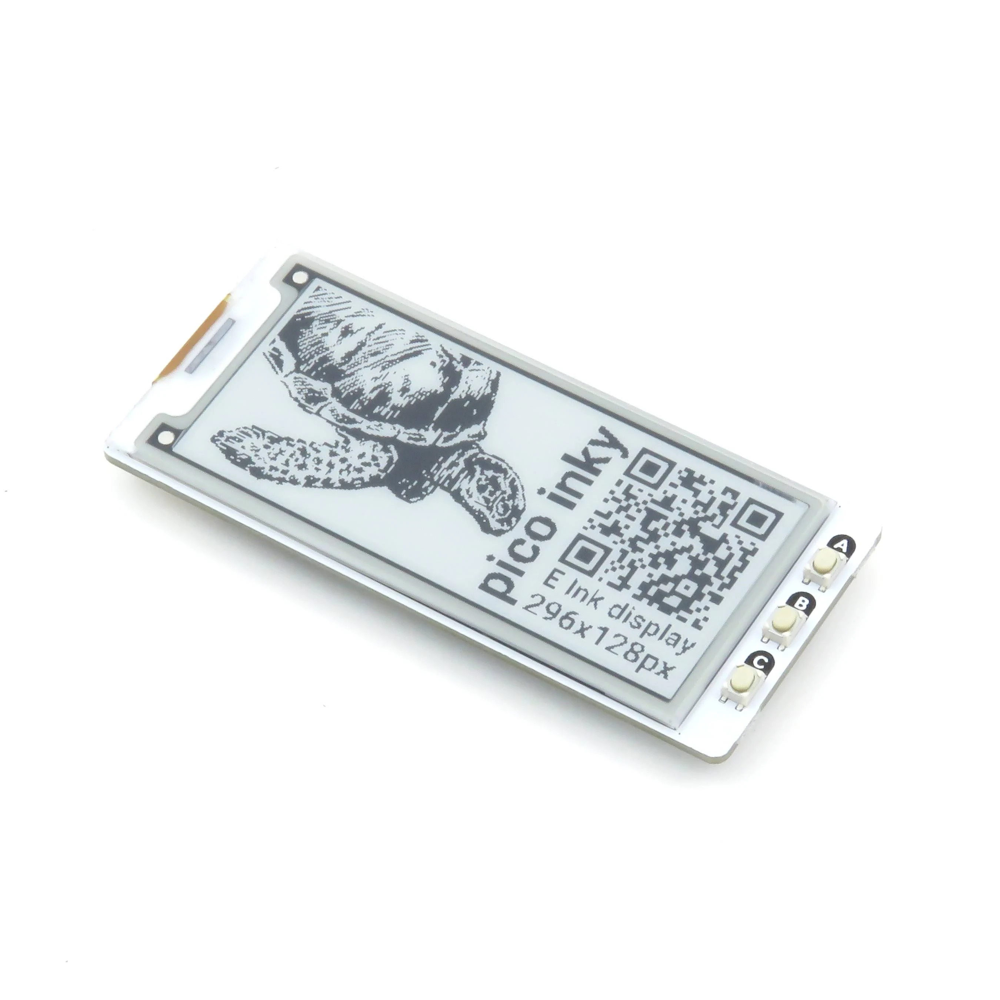
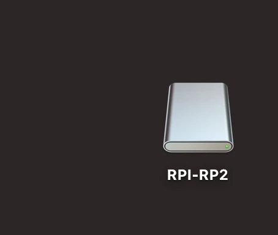
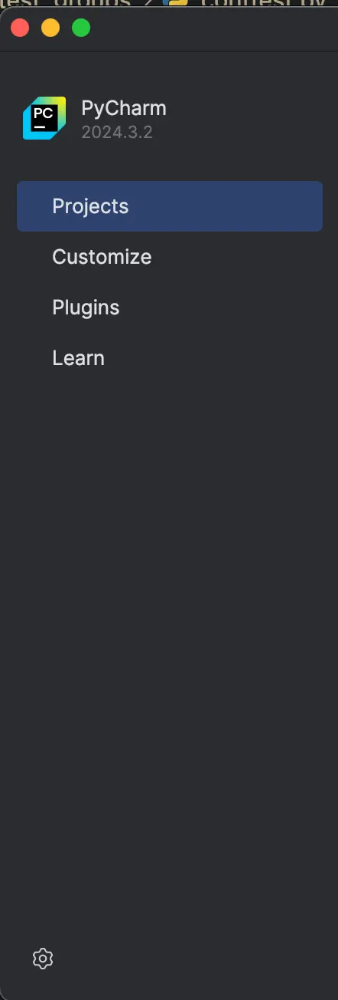
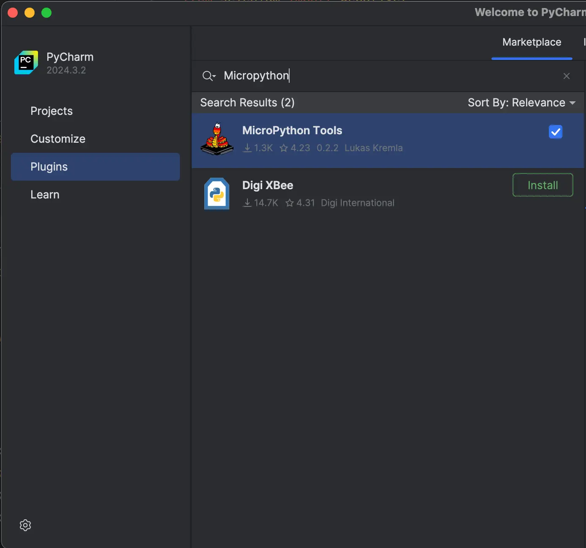
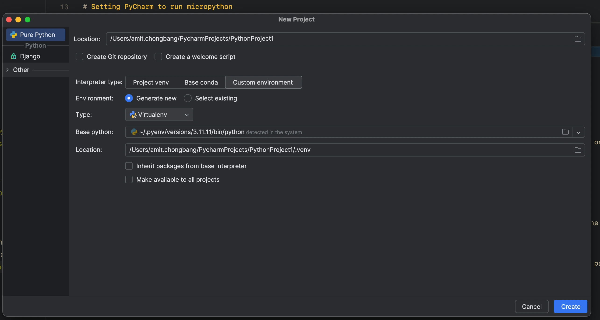
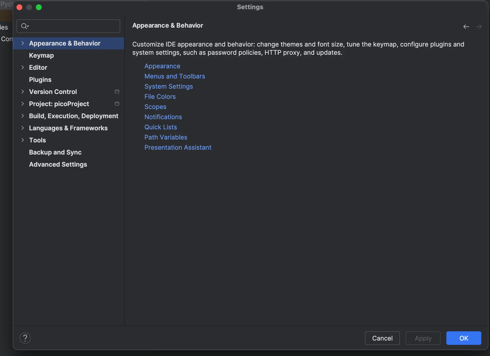
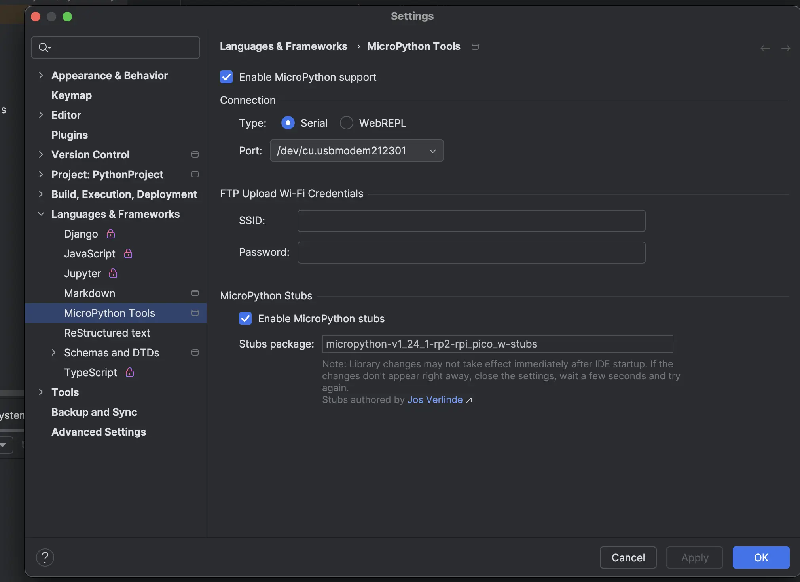
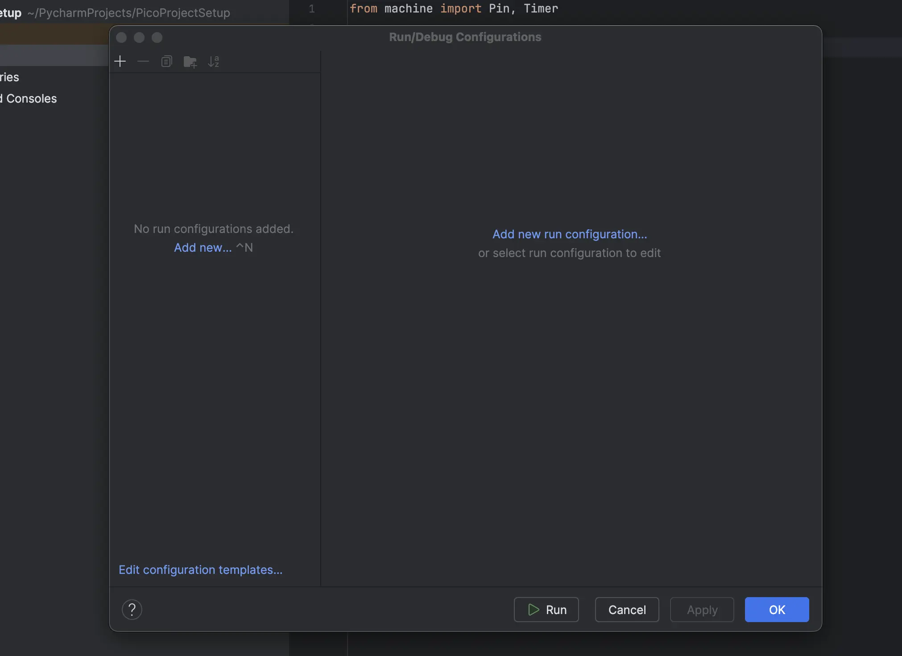
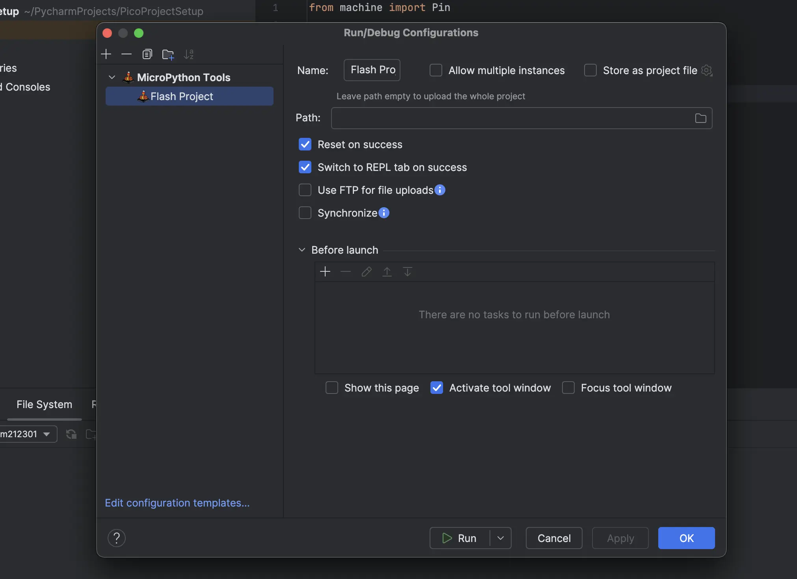

export const postImages = '../images/pycharm-micropython';

# Setting PyCharm to run micropython

This guide is designed to help you start developing MicroPython for the Raspberry Pi Pico W in
PyCharm. While there are various tutorials available, the current MicroPython plugin appears to be
incompatible with **PyCharm Community Edition (2024.3.2)**.

While the setup outlined here may be somewhat specific to developing with the **Pimoroni Inky
Pack**, it can still serve as a helpful starting point for anyone looking to configure PyCharm to
work with MicroPython on any microcontroller board. This guide may be particularly useful for those
who get lost while setting up their environment.



### Installing micropython file in pico w

To begin development with MicroPython, you first need to upload the firmware that runs MicroPython
on your development board. A list of supported devices can be found on the
[MicroPython downloads page](https://micropython.org/download/). Additionally, some companies offer
custom firmware tailored for their products or devices. One such example is the Pico W, where the
Pimoroni team provides a custom firmware specifically designed to support their e-ink displays and
other products.

While the process for uploading MicroPython firmware can vary across different boards, for the Pico
W, simply hold down the `BOOTSEL` button and plug the board into your laptop or desktop to initiate
the upload process.



Once you have the Pico W connected, it should appear as a USB device named `RPI2`. Open the device,
and then drag and drop the appropriate MicroPython firmware into the folder. After the firmware is
successfully **installed**, the `RPI2` USB device will disconnect automatically. At this point,
you're ready to start coding in MicroPython on your Pico W.

### Installing pycharm

Installing PyCharm is generally straightforward, but I recommend using the **JetBrains Toolbox**
manager for installation. The Toolbox manager makes it easy to install and update all JetBrains
products effortlessly. To get started with the **Toolbox**, simply download it from this
[page](https://www.jetbrains.com/toolbox-app/). The installation process is simple and
straightforward for both macOS and Windows.

But there is additional steps to install the **ToolBox**, which can be easily installed by following
these steps:

1. Open terminal/Console and change the directory

   ```bash
   cd /opt/
   ```

2. Extract the file

   ```bash
   sudo tar -xvzf ~/Downloads/jetbrains-toolbox-1.xx.xxxx.tar.gz
   ```

3. Rename the folder (optional but would simplify usage later)

   ```bash
   sudo mv jetbrains-toolbox-1.xx.xxxx jetbrains
   ```

4. Open `JetBrains ToolBox`

   ```bash
   jetbrains/jetbrains-toolbox
   ```

If there is an issue that it cannot open the file just install following pacakge, with your given
package manager:

```bash
sudo apt-get install libfuse2
```

After installing **JetBrains ToolBox**, procced to install PyCharm and on the setup of Micropython
on Pycharm will be done on the next section.

### Setting up Micropython in PyCharm

Open up Pycharm and there should be **Plugins** option on the left-hand side of application.



Select the following option and search for **Micropython Tools** in the search box and click on the
`Install` to install the following plugin in Pycharm.



Create a new Project, select **Pure Python** and select the interpreter type of your choice, for my
configuration I have a preference of using a custom environment select create once your are happy
with everything.



Once pycharm opens, open the settings menu which is located under the `PyCharm -> Settings` option.



Navigate to `Languages & Frameworks` and select `Micropython Tools` and check on
`Enable Micropython Tools`. If your device is connected, select on the dropdown option of **port**
and select your board.



MicroPython stubs are a tool that aids in autocompletion and static type checking for your chosen
development board. You can learn more about it on the following
[GitHub repository](https://github.com/Josverl/micropython-stubs). For my setup, I have selected the
`rp2_pico_w-stubs`.

To verify that your setup is working, create a new file called `main.py` and add the following code.
This is a simple blink example, but you'll need to adjust the code according to the `LED pinout` for
your specific board.

```python
from machine import Pin, Timer

led = Pin("LED", Pin.OUT)
tim = Timer()
def tick(timer):
    global led
    led.toggle()

tim.init(freq=2.5, mode=Timer.PERIODIC, callback=tick)
```

To upload the `main.py` file, you'll need to set up a configuration. Start by selecting the
`Current File` option at the top of the PyCharm window. Then, click on `Edit Configurations`,
followed by `Add New Configuration`.



You should see an option for `MicroPython tools`. Select this option, and it will appear in the
configuration settings. You can specify the file path of your choice, but I’ve kept the default
settings for my setup and selected `Switch to REPL tab on success`. The `REPL` tab will display any
errors that occur when the build or upload fails due to issues in your code.



**EDIT** The synchronize option should also be selected to prevent pushing of old files and just
push the changes that is done to the device, else the device will complain about not having enough
memory.

Once the configuration is set up, you can upload your code by clicking the ▶️ button, which was
previously labeled `Current File` but is now called `Flash Project`. When flashing the code, PyCharm
may prompt you that the device is connected to a different port. Just accept the prompt, and the
code should be uploaded. If the upload is successful, the LED on the board will start blinking,
indicating that the code is working.
